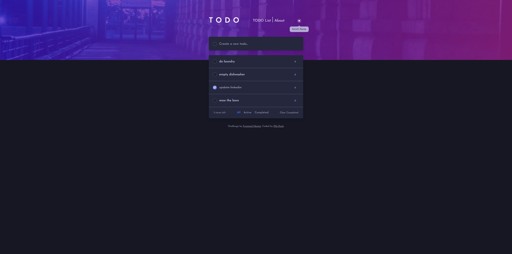
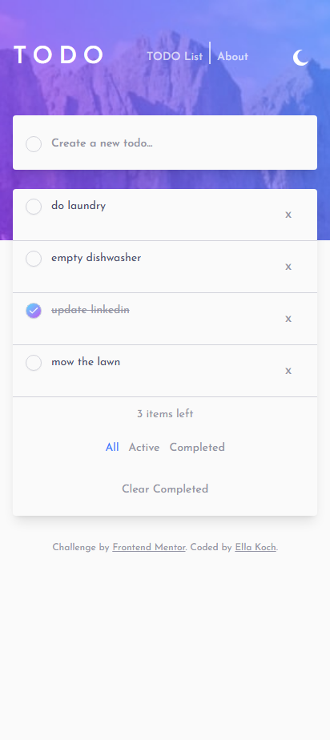

# Todo App

A responsive, theme-aware task management application built with React.

Originally developed during my CodeX Academy frontend coursework and later refactored for portfolio use, this project expands on the Frontend Mentor Todo App challenge with client-side persistence, reusable components, custom theme handling, and a responsive interface.

The project focuses on clear component structure, intentional state management, and separating task logic from presentation.

---

## Live Application

**Live Site:** https://emk-fem-todo-app.netlify.app/

The current production version is deployed on Netlify.

---

## Key Features

- Create, complete, and delete tasks
- Filter tasks by All, Active, and Completed
- Clear all completed tasks
- Persist tasks between visits using localStorage
- Toggle between light, dark, and system themes
- Responsive layout for desktop and mobile screens
- Dedicated About page describing the project's technical focus

---

## Screenshots

### Desktop



### Mobile



---

## Tech Stack

**Frontend**

- React
- Vite
- JavaScript (ES6+)
- Tailwind CSS
- shadcn/ui

**State & Persistence**

- React hooks
- Custom task and theme hooks
- Browser localStorage

**Deployment**

- Netlify — current production deployment
- AWS S3 and CloudFront — previous deployment completed as part of CodeX Academy cloud deployment practice

---

## Technical Approach

Task state and persistence are centralized in a custom `useTasks` hook, keeping task logic separate from presentation components.

The hook manages:

- Loading persisted tasks from localStorage
- Creating new tasks with unique IDs
- Updating task completion status
- Deleting individual tasks
- Clearing completed tasks
- Synchronizing task state with localStorage as tasks change

The interface is built from reusable components, while shared theme tokens provide consistent styling across light and dark modes.

---

## Project Development

This project began as a task-list exercise and evolved through several frontend refactors.

Development included:

- Refactoring an earlier backend-connected version into a focused frontend application
- Moving task persistence to localStorage
- Migrating legacy SCSS and Bootstrap styling to Tailwind CSS and shadcn/ui
- Refactoring repeated interface patterns into reusable components
- Centralizing task behavior in a custom React hook
- Centralizing theme behavior with CSS variables and tokens
- Refining responsive behavior for desktop and mobile layouts
- Reducing duplicated styles and conflicting utility classes

---

## What I Learned

This project strengthened my understanding of:

- Separating application logic from presentation using custom React hooks
- Managing persistent client-side state with localStorage
- Updating React state immutably for create, update, and delete operations
- Building reusable components to reduce duplicated interface logic
- Creating theme systems with shared CSS tokens instead of component-level overrides
- Diagnosing styling issues caused by inherited defaults, tokens, and utility conflicts
- Refactoring an existing application while preserving working functionality

---

## Running the Project Locally

Clone the repository:

```bash
git clone https://github.com/ellamkoch/fem-todo-app.git
cd fem-todo-app
```

Install dependencies:

```bash
npm install
```

Start the development server:

```bash
npm run dev
```

The application will be available at:

```text
http://localhost:5173
```

---

## Future Improvements

Potential future enhancements include:

- Drag-and-drop task reordering
- Expanded automated testing
- Additional accessibility refinements
- Continued responsive-layout refinements

---

## Acknowledgements

This project was inspired by the [Frontend Mentor Todo App challenge](https://www.frontendmentor.io/challenges/todo-app-Su1_KokOW).
